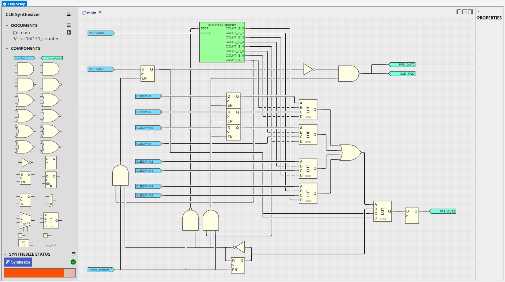

<!-- Please do not change this html logo with link -->

<a href="https://www.microchip.com" rel="nofollow"></a>

# Manchester Encoder with Configurable Bitrate Based on CLB Using the PIC16F13145 Microcontroller with MCC Melody

The repository contains a Manchester Encoder hardware implementation using the Configurable Logic Block (CLB). It uses other peripherals to support the CLB including Timers (TMR0) and Universal Asynchronous Receiver Transmitter (UART) peripherals.

The CLB peripheral is a collection of logic elements that can be programmed to perform a wide variety of digital logic functions. The logic function may be completely combinatorial, sequential or a combination of the two, enabling users to incorporate hardware-based custom logic into their applications.

The Manchester code combines data and clock into a single signal, where one clock cycle is a Manchester bit period with a transition always occurring in the middle of it. Logic `0` is represented by a falling edge (HIGH to LOW transition) in the middle of the bit period, and logic `1` is represented by a rising edge (LOW to HIGH transition) in the middle of the bit period.

<br>

## Related Documentation

More details and code examples on the PIC16F13145 can be found at the following links:

- [PIC16F13145 Product Page](https://www.microchip.com/en-us/product/PIC16F13145?utm_source=GitHub&utm_medium=TextLink&utm_campaign=MCU8_MMTCha_PIC16F13145&utm_content=pic16f13145-manchester-encoder-mplab-mcc&utm_bu=MCU08)
- [PIC16F13145 Code Examples on Discover](https://mplab-discover.microchip.com/v2?dsl=PIC16F13145)
- [PIC16F13145 Code Examples on GitHub](https://github.com/microchip-pic-avr-examples/?q=PIC16F13145)
- [Manchester Decoder with Configurable Bitrate Based on CLB Using the PIC16F13145 Microcontroller with MCC Melody](https://github.com/microchip-pic-avr-examples/pic16f13145-cnano-manchester-decoder-mplab-mcc)
- [Manchester Encoder and Decoder - Use Cases for CIPs Using the AVR128DA48 Microcontroller with MCC Melody](https://github.com/microchip-pic-avr-examples/avr128da48-cnano-manchester-mplab-mcc)


## Software Used

- [MPLAB® X IDE v6.20 or newer](https://www.microchip.com/en-us/tools-resources/develop/mplab-x-ide?utm_source=GitHub&utm_medium=TextLink&utm_campaign=MCU8_MMTCha_PIC16F13145&utm_content=pic16f13145-manchester-encoder-mplab-mcc&utm_bu=MCU08)
- [MPLAB® XC8 v2.46 or newer](https://www.microchip.com/en-us/tools-resources/develop/mplab-xc-compilers?utm_source=GitHub&utm_medium=TextLink&utm_campaign=MCU8_MMTCha_PIC16F13145&utm_content=pic16f13145-manchester-encoder-mplab-mcc&utm_bu=MCU08)
- [PIC16F1xxxx_DFP v1.25.390 or newer](https://packs.download.microchip.com/)


## Hardware Used

- The [PIC16F13145 Curiosity Nano Development board](https://www.microchip.com/en-us/development-tool/EV06M52A?utm_source=GitHub&utm_medium=TextLink&utm_campaign=MCU8_MMTCha_PIC16F13145&utm_content=pic16f13145-manchester-encoder-mplab-mcc&utm_bu=MCU08) is used as a test platform:
    <br>


## Operation

To program the Curiosity Nano board with this MPLAB X project, follow the steps provided in the [How to Program the Curiosity Nano Board](#how-to-program-the-curiosity-nano-board) section.<br><br>

## Concept

This project is a CIP implementation of a Manchester encoder with configurable bitrate. The CPU usage is limited as the encoding process is mostly performed by the CLB and the TMR0 peripherals, and only a small number of CPU cycles are needed to pass the input data to the encoder. The raw data is received via serial communication, encoded using the circuit composed into the CLB peripheral mentioned above and sent through a single data wire. The CLB circuit is captured in the figure below:

<br>

The `ManchesterEncoder.clb` file can be imported into [logic.microchip.com/clbsynthesizer](https://logic.microchip.com/clbsynthesizer/) to better view the circuit.

The CLB software input register is used for the encoder data and control functionality, as noted below:

- Encoder input data register (CLBSWIN[15:8])
- Encoder reset (CLBSWIN[0])
- Encoder enable (CLBSWIN[1])   

The raw data is recevied via serial communication by the UART peripheral and stored in a buffer. The CPU writes the data to the encoder input register after which the encoder is enabled. The CLB internal Hardware Counter and four Look-up Tables (LUTs) are used to select each data bit individually. The equivalent schematic of one LUT is presented below:

<br>

The Hardware Counter is an eight state ring counter, meaning that only one data bit from the input register is selected at a specific time. This allows a parallel to serial transmission conversion of the data stored in the input register. The output stream is then Manchester-encoded using an additional LUT. Its equivalent schematic is presented below:

<br>

To allow back-to-back data transmission, the last three data bits are buffered using additional flip-flops. When the Hardware Counter reaches the fourth state (COUNT_IS_4), the last three bits are loaded into the buffer (flip-flops) and an interrupt flag is set. The interrupt flag is used by the main application to either write the next byte to the encoder input data register or disable the encoder. These actions are performed only after the complete transmission of the current byte. The implemented logic uses the Timer0 overflow (TMR0_OVF) to perform the Manchester-encoded signal transitions, and therefore the bitrate can be easily configured by modifing the TMR0 period.

<br>

## Setup 

The following peripheral and clock configurations are set up using the MPLAB Code Configurator (MCC) Melody for the PIC16F13145:

1. Configuration Bits:
    - External Oscillator mode selection bits: Oscillator not enabled
    - Power-up default value for COSC bits: HFINTOSC (1 MHz)
    - Brown-out reset enable bits: Brown-out reset disabled
    - WDT operating mode: WDT Disabled, SEN is ignored
    <br>

2. Clock Control:
    - Clock Source: HFINTOSC 
    - HF Internal Clock: 32_MHz
    - Clock Divider: 1
    <br>

3. CLB:
    - Enable CLB: Enabled
    - Clock Selection: HFINTOSC
    - Clock Divider: Divide clock source by 2
    <br> 

4. CRC:
    - Auto-configured by CLB

5. NVM:
    - Auto-configured by CLB

6. UART1:
    - Requested Baudrate: 57600
    - Data Size: 8
    - Interrupt Driven: Disabled
    - Receive Enable: Enabled
    - Serial Port Enable: Enabled
    <br>
    <br>

7. TMR0:
    - Enable Timer: Disabled
    - Timer Mode: 8-bit
    - Clock Prescaler: 1:4
    - Postscaler: 1:1
    - Clock Source: HFINTOSC
    <br>

8. Pin Grid View:
    - EUSART1 RX1: RC5 (Data from the CDC terminal)
    - EUSART1 TX1: RC4 (Data to the CDC terminal)
    - CLBPPSOUT2: RB7 (Encoded Message)
    <br>

9. Pins:
    <br>


## Demo

In the demo, the data frames received via CDC UART are transmitted as a Manchester-encoded data stream on the RB7 pin. The data frames should always end with ```0x0A```, ```0x0D```. 

If the UART does not receive any character for 0.5s, the ```PIC16F13145 Manchester Encoder-Decoder\r\n``` message is transmitted via the RB7 pin (Manchester-encoded). The output of the encoder can be visualized using a logic analyzer.

<br>
<br>
<br>

To use the embedded decoder from the Logic software, the following analyzer settings must be done:

<br>

## Summary

This example demonstrates the capabilities of the CLB, a CIP, that can generate a Manchester-encoded data stream with minimal CPU usage.


##  How to Program the Curiosity Nano Board 

This chapter demonstrates how to use the MPLAB X IDE to program a PIC® device with an `Example_Project.X`. This is applicable to other projects.

1.  Connect the board to the PC.

2.  Open the `Example_Project.X` project in MPLAB X IDE.

3.  Set the `Example_Project.X` project as main project.
    <br>Right click the project in the **Projects** tab and click **Set as Main Project**.
    <br>

4.  Clean and build the `Example_Project.X` project.
    <br>Right click the `Example_Project.X` project and select **Clean and Build**.
    <br>

5.  Select PICxxxxx Curiosity Nano in the Connected Hardware Tool section of the project settings:
    <br>Right click the project and click **Properties**.
    <br>Click the arrow under the Connected Hardware Tool.
    <br>Select PICxxxxx Curiosity Nano by clicking on the SN.
    <br>Click **Apply** and then **OK**.
    <br>

6.  Program the project to the board.
    <br>Right click the project and click **Make and Program Device**.
    <br>

<br>

- - - 
## Menu
- [Back to Top](#manchester-encoder-with-configurable-bitrate-based-on-clb-using-the-pic16f13145-microcontroller-with-mcc-melody)
- [Back to Related Documentation](#related-documentation)
- [Back to Software Used](#software-used)
- [Back to Hardware Used](#hardware-used)
- [Back to Operation](#operation)
- [Back to Concept](#concept)
- [Back to Setup](#setup)
- [Back to Demo](#demo)
- [Back to Summary](#summary)
- [Back to How to Program the Curiosity Nano Board](#how-to-program-the-curiosity-nano-board)